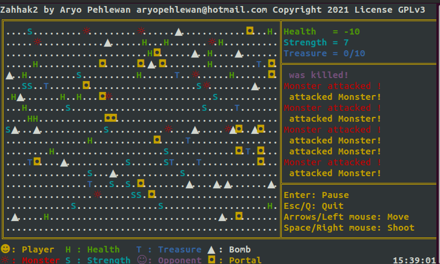

# Zahhak2, a Golang console game.

## Downloads
The 64-bit Linux binary can be downloaded [here](downloads/Zahhak2.linux.zip?raw=true).
The Windows binary is ***experimental and not tested***, it can be downloaded [here](downloads/Zahhak2.windows.zip?raw=true).

## Purpose
To give others a basis of and encouragement of game-programming in Go.

## License
Copyright (c) 2021 Aryo Pehlewan aryopehlewan@hotmail.com 
Licensed under the GPL license.

